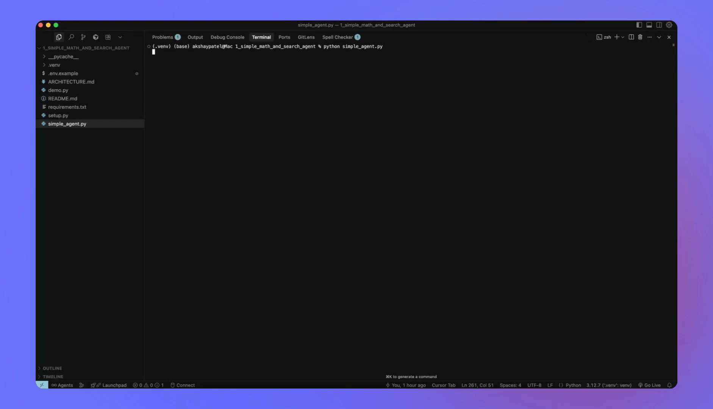

# 🤖 Simple Math and Search Agent using LangChain & LangGraph

> **Part 1 of the AI Agent Series** - Building intelligent agents that can use tools and make decisions

This project demonstrates how to build a basic AI agent that can intelligently decide when to use mathematical calculations or web search tools. It's built using **LangGraph** for workflow management and **LangChain** for tool integration, showcasing a simple but powerful architecture for tool-using AI agents.

## 🎯 What This Agent Can Do

- **🧮 Mathematical Calculations**: Safely evaluate arithmetic expressions using a secure calculator tool
- **🔍 Web Search**: Search the internet using DuckDuckGo (no API key required)
- **🧠 Intelligent Decision Making**: Automatically choose which tools to use based on user requests
- **💬 Natural Conversations**: Handle general questions and maintain conversation context

## 🎬 Demo in Action



*Watch the agent in action! This demo shows the VS Code interface with the agent running, demonstrating the interactive terminal experience and file structure.*

## 🏗️ Architecture Overview

```
User Input → LangGraph Workflow → Tool Selection → Response Generation
     ↓              ↓                ↓              ↓
  Message →   State Management →  Calculator   →  Final Answer
              Tool Decision    →  Web Search
```

### Key Components

1. **State Management**: Uses LangGraph's state system to maintain conversation history
2. **Tool Integration**: Seamlessly integrates mathematical and search tools
3. **Conditional Logic**: Automatically routes requests to appropriate tools
4. **Streaming Responses**: Provides real-time feedback during processing

## 🚀 Quick Start

### Prerequisites

- Python 3.8 or higher
- OpenAI API key (or other supported LLM provider)

### Installation

1. **Clone and navigate to the project:**
   ```bash
   cd 1_simple_math_and_search_agent_using_LC_LG
   ```

2. **Create a virtual environment:**
   ```bash
   python -m venv .venv
   
   # Activate on macOS/Linux
   source .venv/bin/activate
   
   # Activate on Windows
   .venv\Scripts\activate
   ```

3. **Install dependencies:**
   ```bash
   pip install -r requirements.txt
   ```

4. **Set up your API key:**
   ```bash
   # macOS/Linux
   export OPENAI_API_KEY=sk-your-api-key-here
   
   # Windows PowerShell
   $env:OPENAI_API_KEY="sk-your-api-key-here"
   
   # Or create a .env file
   echo "OPENAI_API_KEY=sk-your-api-key-here" > .env
   ```

5. **Run the agent:**
   ```bash
   python simple_agent.py
   ```

## 💡 Usage Examples

### Mathematical Calculations
```
👤 You: What is (2.5 + 7) / 3?
🤖 Agent: Let me calculate that for you.
(2.5 + 7) / 3 = 9.5 / 3 = 3.17

👤 You: Calculate 2^10 + 15 * 3
🤖 Agent: I'll compute that expression for you.
2^10 + 15 * 3 = 1024 + 45 = 1069
```

### Web Searches
```
👤 You: Search for information about LangGraph
🤖 Agent: I'll search for information about LangGraph for you.
[Search results about LangGraph, its features, and use cases]

👤 You: What are the latest developments in AI agents?
🤖 Agent: Let me search for the latest developments in AI agents.
[Recent news and developments in AI agent technology]
```

### Mixed Requests
```
👤 You: Search for the population of Tokyo and then calculate what percentage of Japan's total population that represents
🤖 Agent: I'll help you with that! First, let me search for Tokyo's population and Japan's total population.
[Search results for both populations]
Now let me calculate the percentage:
Tokyo population: 37.4 million
Japan total population: 125.7 million
Percentage: (37.4 / 125.7) × 100 = 29.8%
```

## 🔧 Configuration Options

### Switching Language Models

The agent is designed to work with multiple LLM providers. Edit the `initialize_language_model()` function in `simple_agent.py`:

```python
# OpenAI (default)
llm = init_chat_model("openai:gpt-4o-mini")

# Anthropic Claude
llm = init_chat_model("anthropic:claude-3-5-sonnet-20241022")

# Google Gemini
llm = init_chat_model("google_genai:gemini-1.5-flash")

# Local models (requires Ollama)
llm = init_chat_model("ollama:llama3.1")
```

### Adding New Tools

To extend the agent with additional capabilities:

1. **Define a new tool:**
   ```python
   @tool
   def weather_tool(city: str) -> str:
       """Get current weather for a city."""
       # Implementation here
       return weather_data
   ```

2. **Add to tools list:**
   ```python
   tools = [search_tool, calculator, weather_tool]
   ```

3. **The agent will automatically learn to use it!**

## 🛡️ Security Features

### Safe Calculator Implementation

The mathematical calculator uses Python's AST (Abstract Syntax Tree) to safely parse expressions:

- ✅ **Allowed**: Basic arithmetic, parentheses, exponents
- ❌ **Blocked**: File operations, system calls, imports
- 🔒 **Secure**: Prevents code injection attacks

### Input Validation

- All user inputs are properly sanitized
- Tool outputs are validated before processing
- Error handling prevents crashes from malformed requests

## 📁 Project Structure

```
1_simple_math_and_search_agent_using_LC_LG/
├── simple_agent.py          # Main agent implementation
├── requirements.txt         # Python dependencies
├── README.md               # This documentation
└── .env                    # Environment variables (create this)
```

## 🔍 How It Works

### 1. **Message Processing**
When a user sends a message, it's added to the conversation state.

### 2. **Tool Decision**
The language model analyzes the request and decides whether to:
- Generate a direct response
- Use the calculator tool
- Use the search tool
- Use multiple tools in sequence

### 3. **Tool Execution**
If tools are needed, they're executed with appropriate parameters.

### 4. **Response Generation**
The agent processes tool results and generates a coherent response.

### 5. **State Update**
The conversation state is updated with the new interaction.

## 🧪 Testing the Agent

Try these example prompts to test different capabilities:

- **Math**: "What is 15% of 250?"
- **Search**: "Find information about quantum computing"
- **Combined**: "Search for the current Bitcoin price and calculate what $1000 would buy"
- **Conversation**: "Tell me a joke about programming"

## 🚨 Troubleshooting

### Common Issues

1. **API Key Not Set**
   ```
   ⚠️  Warning: OPENAI_API_KEY environment variable not set.
   ```
   **Solution**: Set your API key as shown in the installation section.

2. **Import Errors**
   ```
   ModuleNotFoundError: No module named 'langchain'
   ```
   **Solution**: Install dependencies with `pip install -r requirements.txt`

3. **Rate Limiting**
   ```
   Rate limit exceeded
   ```
   **Solution**: Wait a moment or upgrade your API plan.

### Getting Help

- Check that all dependencies are installed correctly
- Verify your API key is valid and has sufficient credits
- Ensure you're using Python 3.8 or higher

## 🔮 Future Enhancements

This agent serves as a foundation for more complex systems:

- **Multi-Agent Conversations**: Multiple specialized agents working together
- **Memory Systems**: Long-term conversation memory and learning
- **Advanced Tools**: Database access, file operations, API integrations
- **Web Interface**: Chatbot UI for easier interaction
- **Plugin System**: Dynamic tool loading and management

## 📚 Learning Resources

- [LangGraph Documentation](https://langchain-ai.github.io/langgraph/)
- [LangChain Documentation](https://python.langchain.com/)
- [AI Agent Development Guide](https://langchain-ai.github.io/langgraph/tutorials/)
- [Tool Integration Best Practices](https://python.langchain.com/docs/modules/tools/)

## 🤝 Contributing

This is part of an educational series. Feel free to:
- Experiment with the code
- Add new features
- Improve documentation
- Share your modifications

## 📄 License

This project is for educational purposes. Feel free to use and modify as needed.

---

**🔗 Next in Series**: Stay tuned for more complex agents with advanced capabilities!

**🎯 Perfect for**: Learning AI agent development, understanding LangChain and LangGraph, building foundation for more complex agents, educational and research purposes.
