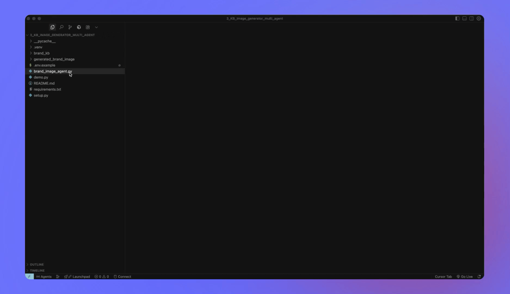

# Brand-Aware AI Image Generator

Multi-agent pipeline for **on-brand image generation** that creates images perfectly aligned with your brand guidelines:
1. **Loads brand knowledge base** (colors, voice, dos/donts, logo variants, typography, style)
2. **Engineers brand-aware prompts** that follow your style guidelines
3. **Generates base images** using OpenAI's DALL-E 3 API
4. **Composites brand logos** exactly as specified without distortion

---

## 🎯 How It Works

This system uses **four AI agents** working together:
- **Brand Knowledge Agent**: Loads and analyzes your brand guidelines
- **Prompt Engineering Agent**: Creates brand-aware image descriptions using AI
- **Image Generation Agent**: Generates images using DALL-E 3
- **Logo Compositing Agent**: Places your logo in the exact position specified

---

## �� Demo in Action



*Watch the four-agent brand-aware system in action! This demo shows the VS Code interface with the brand knowledge base, prompt engineering, image generation, and logo compositing workflow, demonstrating how AI agents collaborate to create perfectly branded images.*

---

## 📂 Project Structure
```
3_KB_image_generator_multi_agent/
├── brand_image_agent.py          # Main multi-agent script
├── brand_kb/
│   ├── brand_kb.json            # Brand guidelines database
│   └── logos/                   # Company logo PNGs
│       ├── acme/                # ACME Robotics logos
│       ├── red&white/           # Red & White Skill Education logos
│       ├── techflow/            # TechFlow Solutions logos
│       ├── creative_studio/     # Creative Studio Arts logos
│       └── eco_green/           # EcoGreen Sustainability logos
├── generated_brand_image/        # Output folder for generated images
├── requirements.txt              # Python dependencies
├── setup.py                     # Automated setup script
├── demo.py                      # Interactive demonstration
└── README.md                    # This file
```

---

## 🚀 Quick Start

### Option 1: Automated Setup (Recommended)
```bash
# Run the automated setup script
python setup.py
```

This will:
- ✅ Check Python version compatibility
- ✅ Install all required dependencies
- ✅ Verify brand knowledge base and logos
- ✅ Create necessary directories
- ✅ Check OpenAI API key setup
- ✅ Show usage examples

### Option 2: Manual Setup

**1. Create and Activate Virtual Environment**
```bash
python3 -m venv .venv
source .venv/bin/activate  # macOS/Linux
# OR
.venv\Scripts\activate     # Windows
```

**2. Install Dependencies**
```bash
pip install -r requirements.txt
```

**3. Set Your OpenAI API Key**
```bash
export OPENAI_API_KEY=your_api_key_here  # macOS/Linux
# OR
set OPENAI_API_KEY=your_api_key_here     # Windows
```

**4. Run the Brand Image Generator**
```bash
python brand_image_agent.py --company acme --idea "A futuristic office space with green plants" --size 1024x1024 --position top-right
```

---

## 🎬 Interactive Demo

Explore the system's capabilities without generating images:
```bash
python demo.py
```

**Demo Features:**
- 🏢 **Brand Overview**: See all 5 brands at a glance
- 📋 **Detailed Analysis**: Deep dive into each brand's guidelines
- 🎬 **Demo Scenarios**: Pre-built examples for each brand
- 🤖 **Workflow Explanation**: Understand how the AI agents work
- ⚙️ **Technical Features**: See all system capabilities

---

## 🏢 Available Brands

The system comes pre-configured with 5 brands:

### **ACME Robotics**
- **Style**: Modern, high contrast, tech-focused
- **Colors**: Red (#FF3B3B), Black (#111111), White (#FFFFFF), Blue (#00D4FF)
- **Voice**: Innovative, confident, minimal, futuristic

### **Red & White Skill Education**
- **Style**: Clean, educational, white backgrounds
- **Colors**: Red (#E50914), White (#FFFFFF), Dark Gray (#1F1F1F)
- **Voice**: Friendly, instructional, trustworthy, encouraging

### **TechFlow Solutions**
- **Style**: Corporate, clean, blue-focused, trustworthy
- **Colors**: Blue (#2563EB), Dark Blue (#1E40AF), White (#FFFFFF)
- **Voice**: Professional, reliable, innovative, approachable

### **Creative Studio Arts**
- **Style**: Colorful, artistic, creative, dynamic
- **Colors**: Purple (#8B5CF6), Pink (#EC4899), Orange (#F59E0B), Green (#10B981)
- **Voice**: Creative, artistic, vibrant, expressive

### **EcoGreen Sustainability**
- **Style**: Natural, organic, green-focused, sustainable
- **Colors**: Green (#059669), Light Green (#10B981), Mint (#34D399), Cream (#FEF3C7)
- **Voice**: Natural, sustainable, trustworthy, eco-friendly

---

## 🛠 Brand Knowledge Base Structure

Each brand in `brand_kb.json` includes:
```json
{
  "brand_name": {
    "display_name": "Brand Display Name",
    "brand_colors_hex": ["#Color1", "#Color2", "#Color3"],
    "voice": "brand personality and tone",
    "visual_style": "overall aesthetic description",
    "dos": ["style guidelines to follow"],
    "donts": ["style guidelines to avoid"],
    "logo_variants": {
      "light": "path/to/light_logo.png",
      "dark": "path/to/dark_logo.png"
    },
    "default_logo_preference": "light or dark",
    "default_logo_position": "logo placement preference",
    "typography": "font style guidelines",
    "image_style": "overall visual approach"
  }
}
```

---

## 🎨 Command Line Usage

### Basic Usage
```bash
python brand_image_agent.py --company <brand> --idea "<image description>"
```

### Full Options
```bash
python brand_image_agent.py \
  --company acme \
  --idea "A futuristic office space with green plants and modern technology" \
  --size 1024x1024 \
  --position top-right
```

### Parameters
- `--company`: Brand name (acme, red&white, techflow, creative_studio, eco_green)
- `--idea`: Your image description
- `--size`: Image dimensions (1024x1024, 1792x1024, 1024x1792)
- `--position`: Logo position (top-left, top-right, top-center, center, bottom-center, bottom-left, bottom-right)

### Real Examples
```bash
# ACME Robotics - Tech Innovation
python brand_image_agent.py --company acme --idea "A futuristic office space with sleek robotics and metallic textures"

# Red & White - Educational Excellence
python brand_image_agent.py --company red&white --idea "Students collaborating in a modern, well-lit classroom"

# TechFlow - Corporate Professionalism
python brand_image_agent.py --company techflow --idea "A team meeting in a clean, modern conference room"

# Creative Studio - Artistic Expression
python brand_image_agent.py --company creative_studio --idea "An artist working in a vibrant, colorful studio"

# EcoGreen - Sustainability Focus
python brand_image_agent.py --company eco_green --idea "A green office space with plants and natural light"
```

---

## 📋 Requirements

- **Python 3.8+**
- **OpenAI API key** with DALL-E 3 access
- **Transparent PNG logos** for each brand
- **Internet connection** for API calls

---

## 🎯 Perfect for Learning

This system demonstrates:
- **Multi-agent AI workflows** with LangGraph
- **Brand consistency** in AI-generated content
- **Professional image generation** with DALL-E 3
- **Real-world AI applications** for marketing and branding
- **Interactive demonstrations** with the demo script
- **Automated setup** for easy onboarding

---

## 🆘 Troubleshooting

**"Brand not found" errors:**
- Check brand name spelling in `brand_kb.json`
- Ensure brand name matches exactly (case-sensitive)
- Use the demo script to see available brands: `python demo.py`

**"Logo file not found" errors:**
- Verify logo files exist in the correct paths
- Check that logos are transparent PNGs
- Run `python setup.py` to verify logo setup

**"OpenAI API key not set" errors:**
- Set your API key: `export OPENAI_API_KEY=your_key_here`
- Make sure to set it AFTER activating your virtual environment
- Run `python setup.py` to check API key status

**Image generation fails:**
- Check your internet connection
- Verify your OpenAI account has credits
- Ensure your prompt follows OpenAI's content policy
- Check that you're using DALL-E 3 compatible image sizes

**Setup issues:**
- Run `python setup.py` for automated troubleshooting
- Check Python version (3.8+ required)
- Verify all dependencies are installed correctly

---

## 🔧 Advanced Usage

### Custom Brand Addition
1. Add your brand to `brand_kb/brand_kb.json`
2. Place logo files in `brand_kb/logos/your_brand/`
3. Run `python setup.py` to verify setup

### Logo Positioning
- **Automatic**: Uses brand's default position
- **Manual**: Override with `--position` parameter
- **Smart Selection**: Automatically chooses light/dark logo based on image brightness

### Image Sizes
- **1024x1024**: Square format (default)
- **1792x1024**: Wide format
- **1024x1792**: Tall format

---

## 🚀 What's New

- ✅ **DALL-E 3 Integration**: Latest image generation technology
- ✅ **Automated Setup**: One-command installation and verification
- ✅ **Interactive Demo**: Explore system capabilities without generating images
- ✅ **Enhanced Brand Guidelines**: Typography and image style specifications
- ✅ **Better Error Handling**: Clear, helpful error messages
- ✅ **Progress Tracking**: Real-time agent workflow visibility
